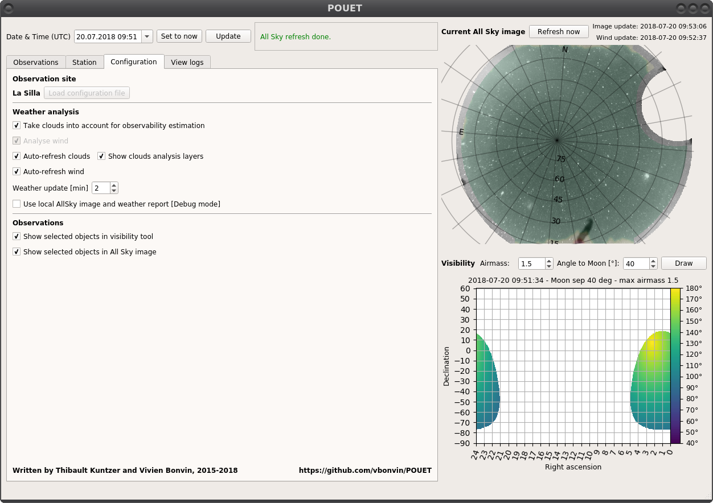
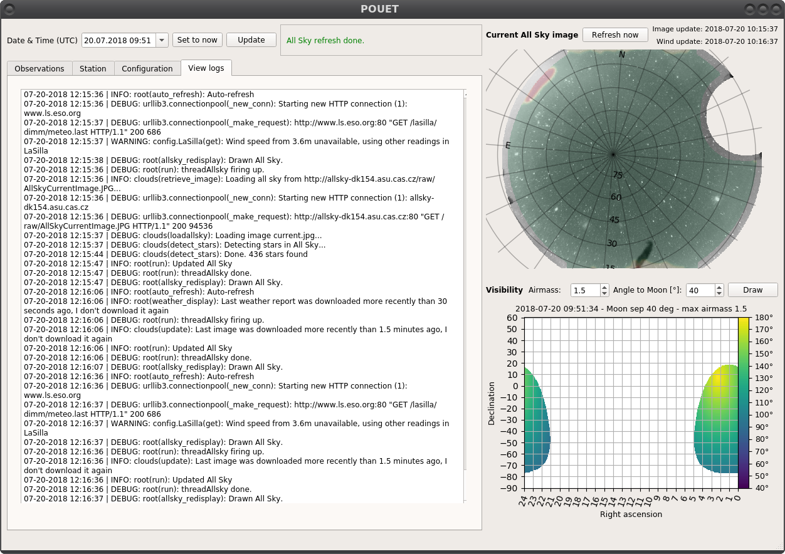

.. _alttabs:

Extra tabs
==========

Besides the ``Observation`` tab are three other important tabs. In this section, we briefly review the important information you can get from them.

Station tab
***********

The ``Station`` tab gives you an overview of the Site conditions: weather status, Sun and Moon position, etc... If something goes wrong (Sun is up in the sky, humidity is too high, wind blows too strong, etc...), the ``Station`` label at the top of the window gets colored, as well as the relevant part in the tab. The example below shows the Site status when the wind blows stronger than the defined pointing limit.

.. figure:: plots/POUET_stationtab.png
    :align: center
    :alt: POUET station tab
    :figclass: align-center

    The ``Station`` tab of POUET indicates that the wind blows above the pointing limit.

The default values at which the ``Station`` panel gets colored can of course be redefined (see :ref:`customsite`).

Configuration tab
*****************

The ``Configuration`` tab allows you to change some of the running parameters of POUET.

By checking/unchecking the checkboxes, you can control the behaviour of the weather analysis. You can also control the behaviour of the ``Display selected`` button in the ``Observations`` panel, if you want the selected targets to be displayed only in the all-sky or visibility view.

.. note:: an upcoming feature (planned for version 0.4) will allow you to create/load a new configuration file directly from the ``Configuration`` panel. Until then, the corresponding button will remains gray, a dull reminder of our failures as developer to deliver everything we promise on time.

View logs tab
*************

Particularly useful is something goes nuts and you don't know why, the ``View logs`` tab keeps track of the majority of what happens in POUET. In case you want to `report a suspicious behaviour <https://github.com/vbonvin/POUET>`_, copy/pasting the last five minutes of the logs along with your report might be super useful for us.

    The ``View logs`` tab of POUET usually displays a massive wall of text.