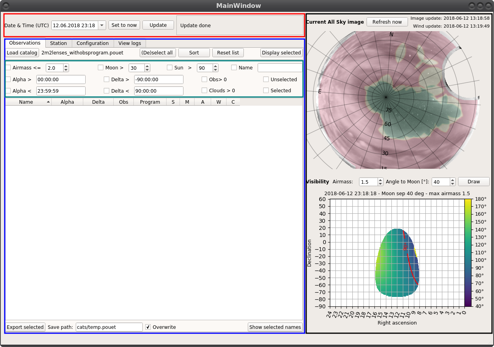
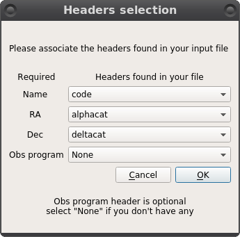
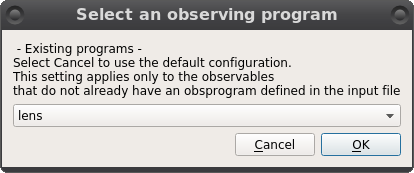

.. _basic_loadandsort:

Buttons, buttons everywhere
***************************

And they all serve a purpose. Let's have a look again at what a freshly opened session of POUET looks like:

    A fresh POUET session, colored for the occasion

The red box at the top allows you to control the date and time.

The blue bow below allows you to display and check the properties of the targets in your catalog - from the ``Observations`` tab. The other tabs allow you to display observing site properties (``Station`` tab), POUET parameters (``Configuration`` tab) and see the log of the operations you performed so far (``View logs`` tab).

The inserted turquoise box allows a finer control of which targets are visible in the ``Observations`` tab.

The black box on the right contains the all sky display and visibility plots.

We will explore in more details these sections later on. For the moment, let's start by importing a bunch of targets into POUET.

Import a catalog
****************

POUET has been primarly designed to let you browse through a large list of targets (a catalog) and highligh/display only the targets of interest.

Thus, your targets need to be arranged in a catalog. A POUET catalog can be as simple as a tab separated file, where each line is a target and each column a property. The first line is a header and second line is a separator. The minimal required properties are the name, alpha (HH:MM:SS.sss) and delta coordinates (DD:MM:SS.sss). A minimal working catalog should look like this:
::
  name	alpha	delta
  ----	-----	-----
  HE0047-1756	00:50:27.83	-17:40:08.8
  J0158-4325	01:58:41.44	-43:25:04.1
  HE0230-2130	02:32:33.1	-21:17:26
  HE0435-1223	04:38:14.9	-12:17:14.4

The reading is done by :meth:`~obs.rdbimport()`, which is a simple wrapper around :meth:`astropy.table.Table.read()`. Whatever suits astropy should work with POUET as well.

.. note:: If you do not have a separator line, you should use ``data_start=1`` in the :meth:`astropy.table.Table.read()` called in :meth:`~obs.rdbimport()`.

To load your catalog in POUET, clic on ``Load catalog`` and chose your file. Then, if the file extension is not ``.pouet`` (more on `creating and using .pouet files`__ later on  (**broken link!!**)), two consecutive popups will appear:

.. __: intro.rst

    Headers selection pop-up

    Default obsprogram selection pop-up

The first pop-up asks you to associate the headers found in your catalog with the ones POUET needs. The fourth header, called Obsprogram, is optional. It relates to the observing program associated to your targets. The observing program defines a set of properties that some of your targets share. Currently, this is limited to the minimal distance to the Moon and the maximum airmass of your target. If you do not have such a property, select ``None`` and then click ``Ok``. The second pop-up asks you to chose a default observing program for the targets that have none assigned. If you click on Cancel, the default observing program will be used.

.. note:: currently, the properties of each observing program are simply used to raise warning flags if your targets are too close to the moon or at too high airmass. It does not prevent your targets to be displayed in POUET, so you can feel safe to use the default observing program (max airmass = 1.5, minimal distance to the moone = 30 deg)

.. warning:: the current import process will be simplified in a future version.

Learn how to `define your own observing program`__ (**broken link!!**).

.. __: intro.rst