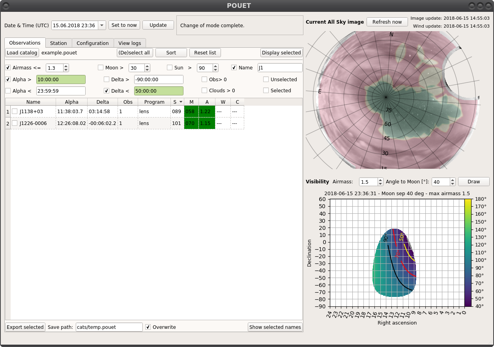
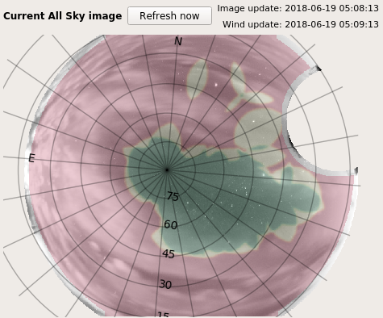
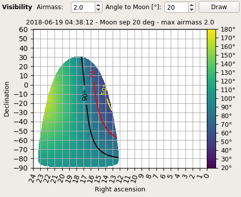
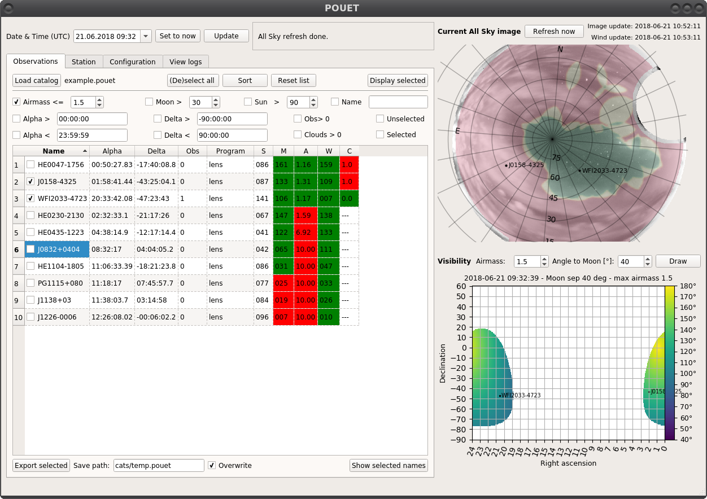

.. _loadandsort:

Load and sort targets
=====================

Buttons, buttons everywhere
***************************

And they all serve a purpose. Let's have a look again at what a freshly opened session of POUET looks like:

.. _main_colored:
.. figure:: plots/POUET_mainwindow_colored.png
    :align: center
    :alt: POUET mainwindow with colored boxes
    :figclass: align-center

    A fresh POUET session, colored for the occasion

The red box at the top allows you to control the date and time.

The blue bow below allows you to display and check the properties of the targets in your catalog - from the ``Observations`` tab. The other tabs allow you to display observing site properties (``Station`` tab), POUET parameters (``Configuration`` tab) and see the log of the operations you performed so far (``View logs`` tab).

The inserted turquoise box allows a finer control of which targets are visible in the ``Observations`` tab.

The black box on the right contains the all sky display and visibility plots.

We will explore in more details these sections later on. For the moment, let's start by importing a bunch of targets into POUET.

Import a catalog
****************

POUET has been primarly designed to let you browse through a large list of targets (a catalog) and highligh/display only the targets of interest.

Thus, your targets need to be arranged in a catalog. A POUET catalog can be as simple as a tab separated file, where each line is a target and each column a property. The first line is a header and second line is a separator. The minimal required properties are the name, alpha (HH:MM:SS.sss) and delta coordinates (DD:MM:SS.sss). A minimal working catalog should look like this:
::
  name	alpha	delta
  ----	-----	-----
  HE0047-1756	00:50:27.83	-17:40:08.8
  J0158-4325	01:58:41.44	-43:25:04.1
  HE0230-2130	02:32:33.1	-21:17:26
  HE0435-1223	04:38:14.9	-12:17:14.4

The reading is done by :meth:`~obs.rdbimport`, which is a simple wrapper around :meth:`astropy.table.Table.read`. Whatever suits astropy should work with POUET as well.

.. note:: If you do not have a separator line, you should use ``data_start=1`` in the :meth:`astropy.table.Table.read()` called in :meth:`~obs.rdbimport()`.

To load your catalog in POUET, clic on ``Load catalog`` and chose your file. Then, if the file extension is not ``.pouet`` (more on this on the :ref:`qol` page), two consecutive popups will appear:

.. figure:: plots/POUET_load_popup_1.png
    :align: center
    :alt: POUET loading pop-up 1
    :figclass: align-center

    Headers selection pop-up
.. figure:: plots/POUET_load_popup_2.png
    :align: center
    :alt: POUET loading pop-up 2
    :figclass: align-center

    Default obsprogram selection pop-up

The first pop-up asks you to associate the headers found in your catalog with the ones POUET needs. The fourth header, called Obsprogram, is optional. It relates to the observing program associated to your targets. The observing program defines a set of properties that some of your targets share. Currently, this is limited to the minimal distance to the Moon and the maximum airmass of your target. If you do not have such a property, select ``None`` and then click ``Ok``. The second pop-up asks you to chose a default observing program for the targets that have none assigned. If you click on Cancel, the default observing program will be used.

.. note:: currently, the properties of each observing program are simply used to raise warning flags if your targets are too close to the moon or at too high airmass. It does not prevent your targets to be displayed in POUET, so you can feel safe to use the default observing program (max airmass = 1.5, minimal distance to the moone = 30 deg). Learn how to define your own observing program on the :ref:`qol` page.

.. warning:: the current import process will be simplified in a future version.

Once a catalog is loaded, all its targets appear in the list view. Try to load the ``example.cat`` catalog available on the ``cats`` folder, chosing the ``lens`` obsprogram. The output should look as follows:

.. figure:: plots/POUET_example_load.png
    :align: center
    :alt: POUET with example.cat loaded
    :figclass: align-center

    Loading the example catalog of lensed quasars.

Each target appear as a line in the list view. Non-straightforwardly understandable header keywords are:

  * ``Obs`` for the observability [0-1]
  * ``S`` for the angular distance to the Sun [degree]
  * ``M`` for the angular distance to the Moon [degree]
  * ``A`` for the airmass [1-10]
  * ``W`` for the angle between the telescope and the wind direction [degree]
  * ``C`` for the cloud index [0-1]

The keyword cells get colored in green or red, depending if the current value matches the obsprogram constraints or not. A description of the wind angle can be found on the ref:`warningmessages` page. The observability and cloud index are detailed in the following section.

.. note:: The wind angle and cloud index are displayed only if the observing time is less than 30min off from the actual time. See ref:`displayandtime` for more details.

Sort your targets
*****************

You can order the list view by clicking on the corresponding headers. Sorting which targets appear in the list view is done through buttons in the small turquoise box of Fig. :numref:`main_colored`. Check the box corresponding on the criteria you want to apply to your list, and enter a value if needed. You can of course mix criteria as it suits you. To apply your sorting criteria, click on the ``Sort`` button.

The sorting criteria are the following:

  * Airmass smaller than
  * Sun distance larger than [degree]
  * Moon distance larger than [degree]
  * Name containing [string pattern]
  * Right Ascension (Alpha) earlier/later than [HH:MM:SS], from 00:00:00 to 24:00:00
  * Declination (Delta) higher/lower than [DD:MM:SS], from -90:00:00 to +90:00:00
  * Clouds index larger than 0. 1 means clear sky, 0 means full cloud coverage.
  * Observability larger than 0. The observability is a combination of airmass, moon distance, wind, cloud coverage, etc... that provide a "smart" way of sorting targets.
  * Selected/unselected targets. You can check targets in the list directly.

.. note:: In future versions of POUET, users will be able to define their own observability formula per observing program. The default one currently used can be read at :meth:`~obs.compute_observability`.

The ``Reset list`` button make all the targets visible again. The same can be achieved by unchecking the sorting boxes and clicking on the ``Sort`` button.

If you sort the ``example.cat`` catalog with a right ascension later than 10h, a declination smaller than 50 degrees, an airmass smaller than 0.3 and keep only the targets that have "J1" in their name, you should have only two targets remaining:

    Sorting the example catalog of lensed quasars.

Display targets on the all-sky and visibility views
***************************************************

The right part of POUET's main window regroups two views. At the top is the all-sky view, and at the bottom is the visibility view.

The all-sky view is, as its name says, an all-sky view from La Silla. The image comes from the `Danish telescope AllSky Camera <http://allsky-dk154.asu.cas.cz>`_, and is refreshed by default every 2 minutes. A RA/DEC grid is superposed on top of it, as well as a cloud analysis layer that colors the view according to the cloud coverage. At the top of the plot are displayed the date of the last update of the all-sky and the wind (see :ref:`warningmessages`) as well as a ``Refresh`` button, especially useful is you deactivate the automatic updates (see :ref:`alttabs`).

    All-sky view

.. warning:: The presence of the moon masks the stars on the all-sky view, thus mimicking the presence of clouds and triggering false cloud detection.

The visibility view is a RA/DEC plot that indicates which region of the sky can be observed according to two criterias: the angle to the Moon, and the airmass. You can change the values at the top of the view and then click ``Draw`` to display a new region. The color of the visible region corresponds to the angle to the Moon, indicated in the right colorbar.

    Visibility view

.. note:: If you hover the mouse cursor over the visibility view, a marker appears on the all-sky view at the corresponding coordinates.

If you check some targets on the list view and click on ``Display selected``, they will appear on the corresponding coordinates on both the all-sky and visibility views.

    Targets displayed on the visibility view

Extra plots
***********

Upon right-clicking on a target in the list view, a drop-down menu will appear, giving you access to additional useful plots for the selected target. Currently, two options are available:

  * ``Show sky chart`` opens a pop-up where you can query existing large sky surveys (currently `DSS <http://archive.eso.org/dss/dss>`_, `NEAT <https://neat.jpl.nasa.gov>`_ and `2MASS-J <https://www.ipac.caltech.edu/2mass/>`_) for a finding chart of your target.

  .. figure:: plots/POUET_skychart.png
    :align: center
    :alt: POUET sky chart
    :figclass: align-center

    Sky chart of HE0435-1223

  * ``Show airmass`` opens an pop-up displaying the evolution of the airmass of your target over its visibility range during the current night, in an Altitude-Azimuth radial grid.

  .. figure:: plots/POUET_airmass.png
    :align: center
    :alt: POUET airmass display
    :figclass: align-center

    Airmass evolution of HE0435-1223 over night

