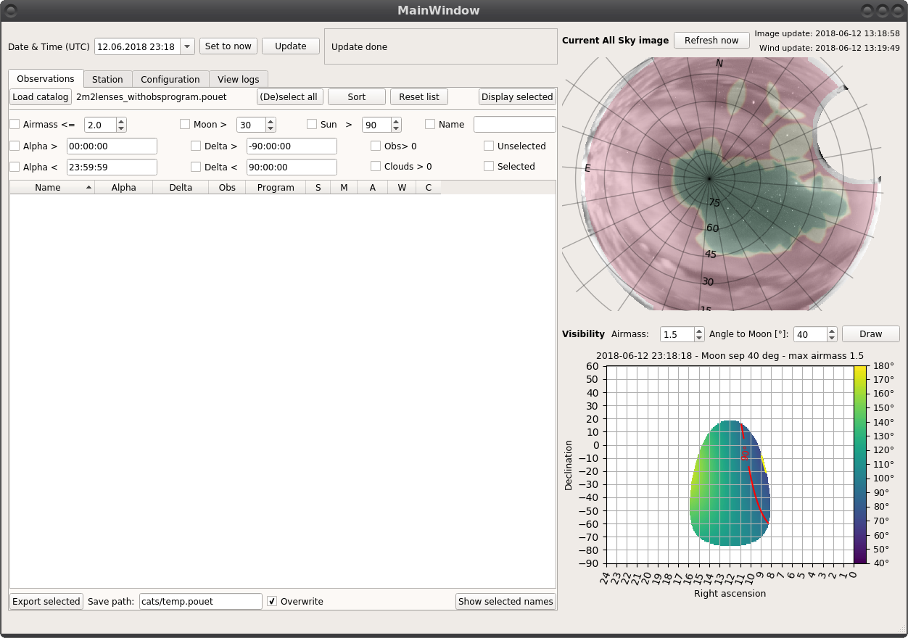

.. _setup:

Set-up POUET
============

Installation...
***************

...is currently not required. Simply `clone/download the repository <https://github.com/vbonvin/POUET>`_ and move to its root.

Make sure you have all the requirements installed
::
    pip install docs/requirements.txt

.. note:: Compatibility with older version of the required modules has not been assessed, but might be working. If you find any backward compatibility, please `let us know <https://github.com/vbonvin/POUET/issues>`_

Tree structure
**************

At the root of POUET, you will find the following directories

  * ``archives`` contains old pieces of code (will disappear in a future version)
  * ``cats`` contains the catalogs loaded/saved by POUET
  * ``docs`` contains the documentation and requirement files
  * ``misc`` contains stuff (will disappear in a future version)
  * ``pouet`` contains the source code
  * ``standalone`` contains standalone version of the plots (will disappear in a future version)
  * ``tests`` contains a series of tests to ensure smooth continuous integration

We will describe these in due time.

Start-up
********

From the root directory:
::
  python pouet/main.py

This will launch POUET in a dedicated window.

    A fresh POUET session.